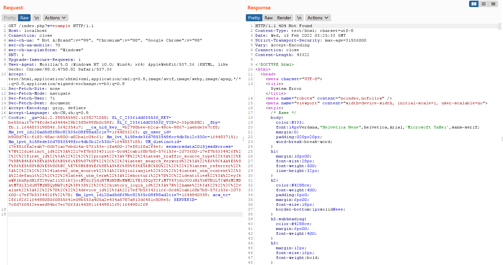
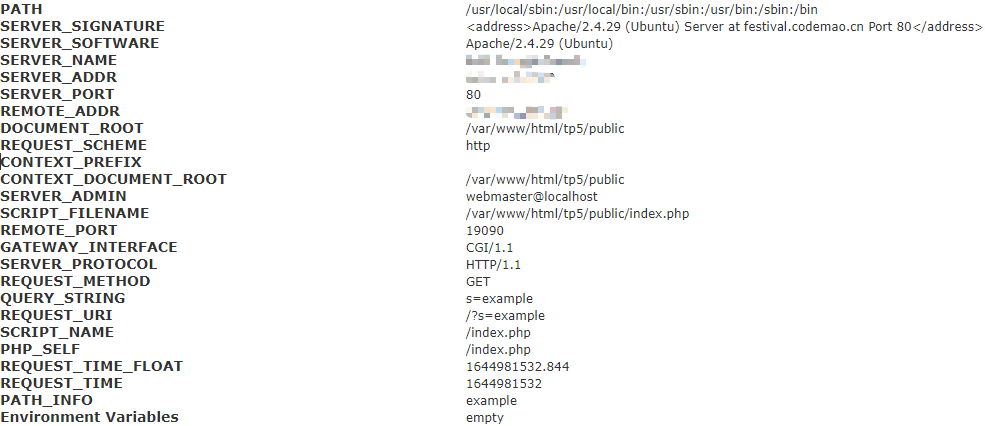
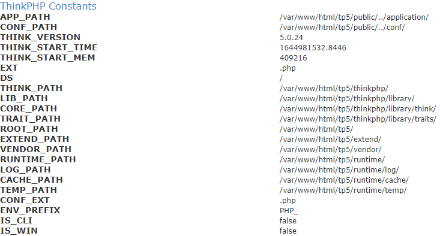

# ThinkPHP Information Leak

Discovered in ThinkPHP 5.0.24 default page.

While the `PATHINFO` hasn't been configured then ThinkPHP would receive parameter like `http://serverName/index.php?s=/ modular / controller / operation /[ Parameter name / Parameter values ...]`.

If the modular has not been found, system information would be a leak.

## PoC

Given the following request parameter in `index.php`:

```html
GET /index.php?s=example HTTP/1.1
```



Got the following system information:

**Server/Request Data**



**ThinkPHP Constants**



## Summary

The default page of ThinkPHP has the problem of information leakage. Some sensitive system information is leaked.

